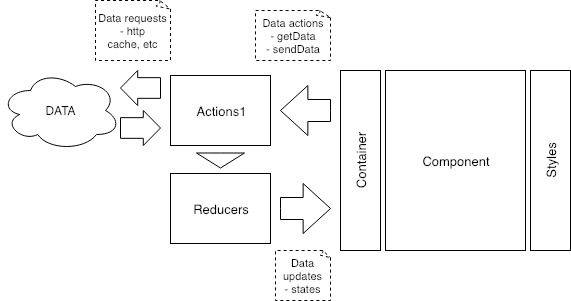

# ReactJS Web

This repository holds the source code of a **reference** for the development of a **React.js web** written mainly in javascript.

## Before start

## Architecture design

The reference uses a architecure based on [Flux architecture](https://facebook.github.io/flux/docs/in-depth-overview.html) and a Generic Model View Controller pattern.

### Overview



### Description

The architecture uses the following structure:

-  /actions: Handle data operations such as CRUD actions
  > This component is the responsible of manage connection to REST APIs, websockets, etc.
-  /components: Handle DOM rendering and event definition.
-  /containers: Handle the connection between actions and components (data & views).
  > All containers must have a component, but components don’t necessarily require a container.
-  /reducers: Represents the link between actions and containers through updates of states (data & states).
-  /styles: Handle DOM styling (e.g. colors, dimensions, etc.).

### To start coding and build:

-  Clone this repository.
-  Install dependencies.
```bash
$ npm install
```

-  Run server.
```bash
$ npm start
```

### Examples

-   Request example. 
```bash
GET http://localhost:3000
```


## Deploy to aws eb

### Create an elastic beanstalk instance

-  Open aws console in [aws.amazon.com](https://aws.amazon.com)
-  Go to elastic beanstalk pane
-  Create a new application (if required)
-  Create a new environment
   - Select nodejs platform  
   
### Security settings

-  To enable security protocols, see [security.md](./bin/security.md)

### Install & configure eb terminal

-  Install eb terminal [Documentation](https://docs.aws.amazon.com/es_es/elasticbeanstalk/latest/dg/eb-cli3-install.html)
-  Create credentials [Documentation](https://docs.aws.amazon.com/es_es/general/latest/gr/managing-aws-access-keys.html)

### Set production settings

-  Configure src/settings/Urls.js file with api & server settings

### Deploy

-  Build app
```bash
$ npm run-script build
```
-  Deploy to aws
```bash
$ eb deploy
```