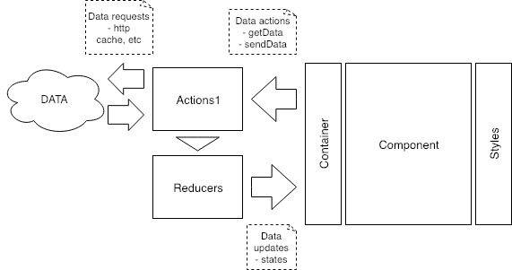

# React.js Web

This repository holds the source code of a **reference** for the development of a **React.js web** written mainly in javascript.

## Before start ##

## Architecture design

The reference uses a architecure based on [Flux architecture](https://facebook.github.io/flux/docs/in-depth-overview.html) and a Generic Model View Controller pattern.

### Overview 



### Description

The architecture uses the following structure:

  - /actions: Handle data operations such as CRUD actions
    > This component is the responsible of manage connection to REST APIs, websockets, etc.
  - /components: Handle DOM rendering and event definition.
  - /containers: Handle the connection between actions and components (data & views).
    > All containers must have a component, but components don’t necessarily require a container.
  - /reducers: Represents the link between actions and containers through updates of states (data & states).
  - /styles: Handle DOM styling (e.g. colors, dimensions, etc.).


### To start coding and build:

 * Clone this repository.
 * Install dependencies.
 ```bash
 $ npm install
 ```
 * Run server.
 ```bash
 $ npm start
 ```

  ### Examples

  * Example requests. 
 ```bash
 GET http://localhost:3000
 ```


